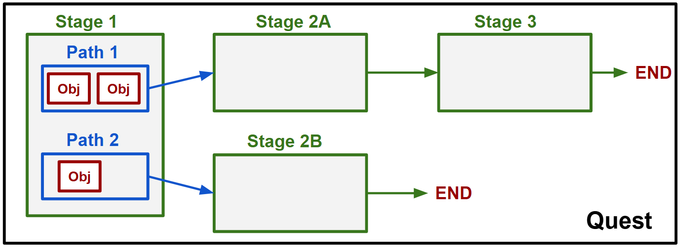
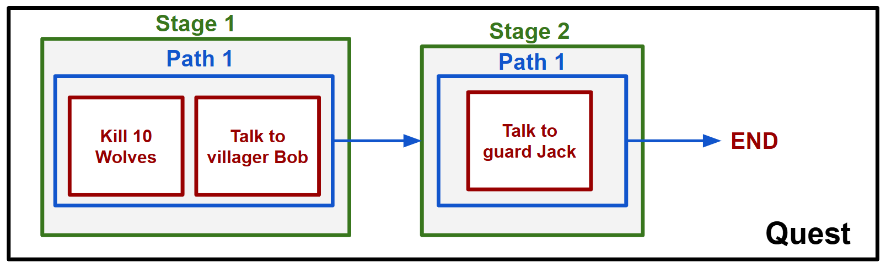

**Work in progress**
# GameDevEssentials-QuestSystem  
## **Introduction**   
A collection of classes to create an in-game quest system.  
The package is compatible with **Godot 4.4 / .Net 8.0**  
Note: Not compatible with Unity

## **How to use**  
There are presently 2 alternatives available:   
- Download latest nupkg file from 'Releases' section and use with a local NuGet repo. (Recommended)  
- Copy the contents of the QuestSystem folder to your project

## **Main Structure of the System**  
**Key entities: Objective, StagePath, QuestStage, Quest**  
  
- A Quest is made from one or more stages.
- Each stage is made up from one or more stage paths.
- Each stage path indicates the next stage unlocked upon its completion. (aka branching)  
  Note: Stage paths are connected with a logical 'OR', since they lead to different outcomes  
- A stage path consists of one or more objectives.
- A stage path can be normal. (all its objectives must be completed)
- Or selective (only one of its objectives must be completed)

**Example schematic of a short quest with some branching:**




## **Basic Example (Godot 4.4)** 
**Begin by creating a 'QuestManager' Node**  

```csharp
//Your namespace here 

using Godot;
using System.Collections.Generic;
using QuestSystem.Entities;
using QuestSystem.Parser;
using QuestSystem.Parser.Util;

// This is a singleton that will be handling all quest-related functionality
public partial class QuestManager : Node
{
    // Have collections to store your in-game quests
    public List<Quest> ActiveQuests { get; } = new();

    public override void _Ready()    {
        // Load all the game quests (opt1 requires a QuestLibrary.cs)
        //ActiveQuests.Add(QuestLibrary.CreateDemoQuestWithEnums()); //From a library script (Method 1) OR
        //ActiveQuests.AddRange(LoadQuestsFromJson("quest.json"));   //From a JSON file(Method 2)

        // In a more realistic setup, you would check the player's save file here
        // to determine active and completed quests, their exact progress etc

        // Check what was loaded
        if(ActiveQuests.Count == 0) return;
        foreach (var quest in ActiveQuests) {
            PrintQuestProgress(quest);
        }
    }
    
    // Method to be called when something that could progress a quest happens
    // Can also be added as subcr to custom events: e.g. EnemyKilled, MapUnlocked, AreaDiscovered etc.
    private void ProgressQuests( int progressValue,int taskId, int assetId = -1)    {
        // READ BELOW for function body
    }
    
    private List<Quest> LoadQuestsFromJson(string jsonPath){
        // READ BELOW for function body
        return[];
    }

    //Helper method for printing info on terminal
    private void PrintQuestProgress(Quest quest) {
        GD.Print($"\nQuest {quest.Id}: '{quest.Title}'");
        GD.Print($"Completed: {quest.IsCompleted}");
        GD.Print($"Active Stage Id: {quest.CurrentStage?.Id}");
        GD.Print($"Stage Description: {quest.CurrentStage?.Description}");
        GD.Print(quest.CurrentStage?.GetProgress());
    }
    
}
```

**Let's assume we want to create the following simple quest, containing 2 (normal) stages and 3 objectives in total :**      
Note: Stage 1 - Path 1 is 'normal', which means there is a logical **'AND'** between its two objectives  



## **LOAD METHOD 1 : Create quests via scripting**   
Note: This approach is not practical for large-scale projects with many complex quests  

**It is higly recommended that you create some helper enums for your specific game**  
For our needs consider the following:  
```csharp
public enum TaskType {
    None = 0,
    Gather = 1,
    Talk= 2,
    Kill= 3
}

public enum EnemyType {
    None = 0,
    Toad = 1,
    Wolf= 2,
    Orc= 3
}

public enum NpcType {
    None = 0,
    VillagerBob = 1,
    GuardJack= 2,
    King = 3
}
```

The quests of the game can be hardcoded into a Library with static methods:   
(After adding questLIbrary.cs, uncomment corresponding line on QuestManager._Ready)  
Note: Enums improve the readability a lot here

```csharp
//Your namespace

using QuestSystem.Entities;

// This is a demo class which contains one hardcoded quest
public class QuestLibrary
{
    // Method to create a demo quest
    // Uses the enums defined above
    public static Quest CreateDemoQuestWithEnums(){
        
        // First we declare the objectives of Stage 1 - Path 1:
        // 10 kills (action id = 3) of wolves ( asset/enemy id = 2)
        var killWolvesObjective = new Objective(10, (int)TaskType.Kill, (int)EnemyType.Wolf);
        // 1 Talk (action id = 2) to villager Bob (asset/NPC id = 1)
        var TalkBobObjective    = new Objective(1, (int)TaskType.Talk, (int)NpcType.VillagerBob);
    
        // Then we combine them in a stage path
        // Normal Path: ALL objectives must be completed to complete the path.
        // Selective Path: ANY of the objectives must be completed to complete the path.
        bool isSelective = false;
        
        // Each stage path indicates the stage unlocked, upon its completion
        // If completing this path ends the quest, set nextStageId to -1
        int nextStageId = 2; // in this case there is a next stage.
        StagePath path1_1 = new StagePath(isSelective, nextStageId, killWolvesObjective, TalkBobObjective);
        
        //We combine the stage paths to form stage 1
        int stageId = 1; //Should be unique per quest
        string stage1Description = "Kill 10 wolves AND talk to villager Bob";
        QuestStage stage1 = new QuestStage(stageId,stage1Description, path1_1);

        // Then we move to Stage 2 - Path 1:
        var talkGuardJackObjective = new Objective(1, (int)TaskType.Talk, (int)NpcType.GuardJack);
        StagePath path2_1 = new StagePath(false, -1, talkGuardJackObjective); // no next stage means '-1' in the 2nd arg
        string stage2Description = "Talk to guard Jack"; 
        QuestStage stage2 = new QuestStage(2,stage2Description, path2_1);
    
        //Finally, create the quest object
        int questId = 1; //Should be unique
        string questTitle = "Practicing the basics !";
        bool isMainQuest = true; // Optional: Common need to discriminate main and optional quests
        int nextQuestId = 2;     // Optional: For quest-chain support
        Quest newQuest = new Quest(questId, questTitle, isMainQuest, nextQuestId, stage1, stage2);

        return newQuest;
    }
}  
```    
### Notes on the values of the Objective args:  
- **The maximum quest title length is 200 characters**  
- **The maximum stage description length is 2000 characters**  
- **The maximum goal value is 999,999**  
- **The maximum taskTypeId value & assetId value is 9999**

## **LOAD METHOD 2 : Parse Quest details from a json file**  
This method allows for clear separation of the quest details and the code base  

Below we have the same quest in the form of a 'quest.json' file:  
```json
[
  {
    "Id": 2,
    "Title": "Practicing the basics - JSON VER !",
    "Stages": [
      {
        "Id": 1,
        "Description": "Kill 10 wolves AND talk to villager Bob",
        "PathDtos": [
          {
            "IsSelective": false,
            "NextStageId": 2,
            "Objectives": [
              {
                "GoalValue": 10,
                "TaskTypeId": 3,
                "TargetAssetId": 2
              },
              {
                "GoalValue": 1,
                "TaskTypeId": 2,
                "TargetAssetId": 1
              }
            ]
          }
        ]
      },
      {
        "Id": 2,
        "Description": "Talk to guard Jack",
        "PathDtos": [
          {
            "IsSelective": false,
            "NextStageId": -1,
            "Objectives": [
              {
                "GoalValue": 1,
                "TaskTypeId": 2,
                "TargetAssetId": 2
              }
            ]
          }
        ]
      }
    ]
  }
]
```
Note: There are some logical checks in the deserializer (e.g. no negative goal values)  
  
To load quest(s) present in json file(s), update the body of the QuestManager.LoadQuestsFromJson as follows:  

```csharp
private List<Quest> LoadQuestsFromJson(string jsonPath){
    // Load from your path of choice
    // Can also pass serializer options as 2nd arg
    MultiParseResult parseResult = QuestParser.LoadFromJsonFile(jsonPath);
    
    // Here you can access your parsed quests
    List<Quest> parsedQuestList = parseResult.Quests;
    
    // Check for parsing errors (useful for many quests present in a single json)
    var errorsList = parseResult.ErrorMessages;
    if(errorsList.Count != 0){
        foreach(var error in errorsList) GD.PrintErr(error);
    }
    return parsedQuestList;
}
```

## **Quest Progress**    
**Next we need a function to progress the active quests:**
```csharp
// Method to be called when something that could progress a quest happens
// Can also be added as subcr to custom events: e.g. EnemyKilled, MapUnlocked, AreaDiscovered etc.
private void ProgressQuests( int progressValue,int taskId, int assetId = -1)
{
        GD.Print($"\nReceived progress: {progressValue} for taskId:{taskId}, for asset: {assetId}");
        
        var activeQuestsCopy = new List<Quest>(ActiveQuests); //avoid mid-loop deletion issues
        foreach(var quest in activeQuestsCopy){
            // try to progress quest using the in-package progress function
            quest.TryProgressQuest(progressValue, taskId, assetId);
        
            // Check for completion and rewards
            if(quest.IsCompleted){
                GD.Print($"\nQuest {quest.Id} COMPLETED");
                // Here do sth like giving rewards based on how your game works
                ActiveQuests.Remove(quest);
        
                // Can also use logic to start next quest in chain (if it exists) - UNDER TESTING
            }
            // Otherwise maybe update some UI or log sth with the quest progress
        }
}
```
  
**TIP**  
For easier quest progressing create overrides like:  
```csharp
private void ProgressQuests(int progressValue, TaskType taskType, EnemyType enemyType) {
        ProgressQuests( progressValue, (int)taskType, (int)enemyType);
}
    
private void ProgressQuests(int progressValue, TaskType taskType, NpcType npcType) {
    ProgressQuests( progressValue, (int)taskType, (int)npcType);
}
```